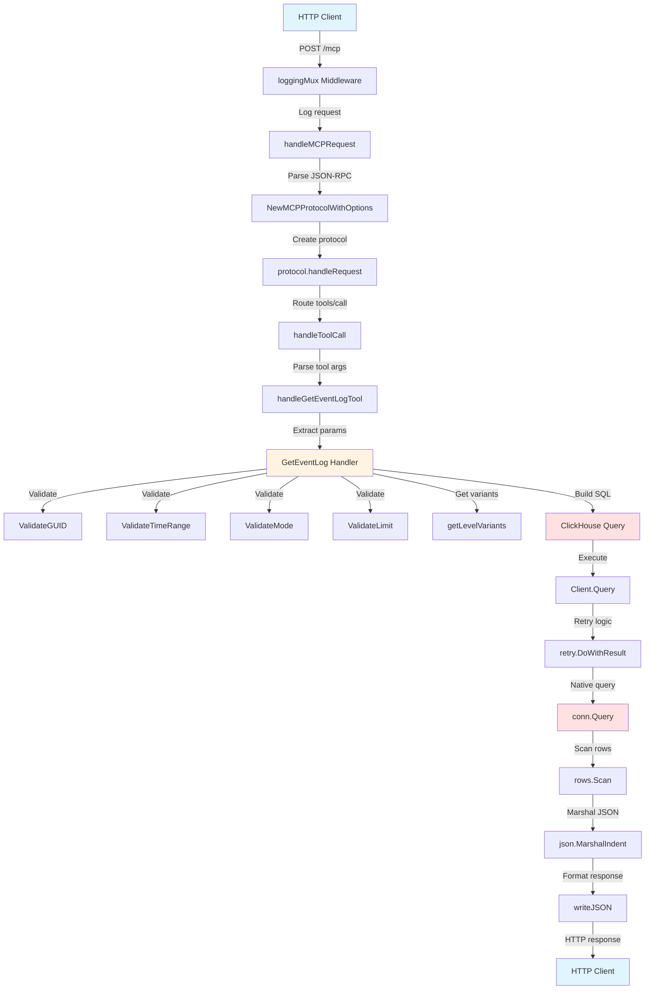

# Граф вызовов метода `logc_get_event_log`

## Описание

Данный документ описывает полный граф вызовов метода `logc_get_event_log` от момента получения HTTP-запроса до выполнения SQL-запроса к ClickHouse и возврата результата.

## Визуализация графа вызовов



## Детальный граф вызовов

### 1. HTTP Layer (internal/mcp/server.go)

```
HTTP Request (POST /mcp)
  └─> loggingMux (middleware)
      └─> handleMCPRequest(w http.ResponseWriter, r *http.Request)
          ├─> [STEP 1] Parse JSON-RPC request body
          │   └─> json.NewDecoder(r.Body).Decode(&req)
          │
          ├─> [STEP 2] Create MCP protocol handler
          │   └─> NewMCPProtocolWithOptions(s, true)
          │       └─> NewMCPProtocol(s)
          │           └─> Load tools from embedded tools.json
          │
          ├─> [STEP 3] Convert to MCPRequest format
          │   └─> Create MCPRequest struct
          │
          ├─> [STEP 4] Setup response capture
          │   └─> Create httpResponseWriter
          │       └─> Replace protocol.stdout with responseWriter
          │
          └─> [STEP 5] Call protocol.handleRequest
              └─> protocol.handleRequest(ctx, mcpReq)
```

### 2. MCP Protocol Layer (internal/mcp/stdio.go)

```
protocol.handleRequest(ctx, req *MCPRequest)
  └─> [STEP 6] Route by method
      └─> case "tools/call":
          └─> handleToolCall(ctx, req)
              ├─> [STEP 7.1] Unmarshal tool call params
              │   └─> json.Unmarshal(req.Params, &callReq)
              │
              ├─> [STEP 7.2] Log tool call request
              │
              ├─> [STEP 7.3] Route to tool handler
              │   └─> case "logc_get_event_log":
              │       └─> handleGetEventLogTool(ctx, callReq.Arguments)
              │           ├─> [STEP 8.1] Extract cluster_guid
              │           ├─> [STEP 8.2] Extract infobase_guid
              │           ├─> [STEP 8.3] Extract and set defaults:
              │           │   ├─> mode (default: "minimal")
              │           │   ├─> level (default: "Error")
              │           │   ├─> from (default: now - 10 minutes)
              │           │   ├─> to (default: now)
              │           │   └─> limit (from args or default)
              │           │
              │           └─> [STEP 8.4] Call GetEventLog handler
              │               └─> m.server.eventLogHandler.GetEventLog(ctx, params)
              │
              ├─> [STEP 7.4] Check for errors
              │
              ├─> [STEP 7.5] Format result
              │   └─> Convert result to string
              │       └─> If empty, set to "[]"
              │
              ├─> [STEP 7.6] Create MCPResponse
              │   └─> Build response with content array
              │
              └─> [STEP 7.7] Write JSON response
                  └─> writeJSON(response)
                      └─> json.NewEncoder(m.stdout).Encode(v)
```

### 3. Handler Layer (internal/handlers/event_log.go)

```
GetEventLog(ctx, params EventLogParams) (string, error)
  ├─> [STEP 9] Entry point logging
  │
  ├─> Start tracing span
  │   └─> startSpan(ctx, "handlers.GetEventLog", ...)
  │
  ├─> Validation phase
  │   ├─> ValidateGUID(params.ClusterGUID, "cluster_guid")
  │   ├─> ValidateGUID(params.InfobaseGUID, "infobase_guid")
  │   ├─> ValidateTimeRange(params.From, params.To)
  │   ├─> ValidateMode(params.Mode)
  │   └─> ValidateLimit(params.Limit)
  │
  ├─> Set defaults
  │   ├─> If mode == "" → "minimal"
  │   └─> If limit <= 0 → 1000
  │
  └─> Query execution (mode == "minimal")
      ├─> [STEP 9.1] Build SQL query
      │   ├─> Base query with WHERE clause
      │   ├─> Add level filter (if specified)
      │   │   └─> getLevelVariants(params.Level)
      │   │       └─> Returns []string{"Ошибка", "Error"} or single value
      │   │
      │   └─> Build args array:
      │       ├─> params.ClusterGUID
      │       ├─> params.InfobaseGUID
      │       ├─> params.From
      │       ├─> params.To
      │       ├─> level variants (if level specified)
      │       └─> params.Limit
      │
      ├─> [STEP 9.2] Execute query
      │   └─> h.ch.Query(ctx, query, args...)
      │       └─> ClickHouse Client.Query()
      │           └─> retry.DoWithResult(ctx, c.retryCfg, func() {
      │               └─> c.conn.Query(ctx, query, args...)
      │                   └─> ClickHouse native driver query
      │           })
      │
      ├─> [STEP 9.3] Scan rows
      │   └─> for rows.Next():
      │       └─> rows.Scan(&record.EventTime, &record.Level, ...)
      │           └─> Append to results[] array
      │
      ├─> [STEP 9.4] Check rows.Err()
      │
      ├─> [STEP 9.5] Marshal to JSON
      │   └─> json.MarshalIndent(results, "", "  ")
      │
      └─> [STEP 9.6] Return JSON string
          └─> If empty, return "[]"
```

## Ключевые функции и их назначение

### HTTP Layer

| Функция | Файл | Назначение |
|---------|------|------------|
| `loggingMux` | `server.go:153` | Middleware для логирования всех HTTP-запросов |
| `handleMCPRequest` | `server.go:631` | Обработчик HTTP-запросов MCP, парсит JSON-RPC, создает protocol handler |

### MCP Protocol Layer

| Функция | Файл | Назначение |
|---------|------|------------|
| `NewMCPProtocolWithOptions` | `stdio.go` | Создает MCP protocol handler с опциями (skipNotifications для HTTP) |
| `handleRequest` | `stdio.go:185` | Маршрутизирует запросы по методу (initialize, tools/list, tools/call) |
| `handleToolCall` | `stdio.go:297` | Обрабатывает вызовы инструментов, парсит аргументы, вызывает конкретный handler |
| `handleGetEventLogTool` | `stdio.go:415` | Извлекает параметры из map[string]interface{}, преобразует в EventLogParams |
| `writeJSON` | `stdio.go:663` | Записывает JSON-ответ в stdout (в HTTP режиме - в responseWriter) |
| `sendError` | `stdio.go:649` | Отправляет JSON-RPC error response |

### Handler Layer

| Функция | Файл | Назначение |
|---------|------|------------|
| `GetEventLog` | `event_log.go:51` | Основной handler, выполняет валидацию, строит SQL, выполняет запрос |
| `getLevelVariants` | `event_log.go:34` | Возвращает русский и английский варианты уровня логирования |
| `ValidateGUID` | `validation.go:22` | Валидирует формат GUID |
| `ValidateTimeRange` | `validation.go:86` | Валидирует временной диапазон |
| `ValidateMode` | `validation.go:113` | Валидирует режим запроса (minimal/full) |
| `ValidateLimit` | `validation.go:138` | Валидирует лимит записей |
| `startSpan` | `tracing.go:19` | Создает OpenTelemetry span для трейсинга |
| `endSpanWithError` | `tracing.go:37` | Завершает span с ошибкой |

### ClickHouse Layer

| Функция | Файл | Назначение |
|---------|------|------------|
| `Client.Query` | `clickhouse/client.go:89` | Выполняет SQL-запрос с retry логикой |
| `retry.DoWithResult` | `retry/` | Повторяет операцию при ошибках с экспоненциальной задержкой |
| `conn.Query` | ClickHouse driver | Нативный запрос к ClickHouse через драйвер |

## Поток данных

### Входные данные (HTTP Request)

```json
{
  "jsonrpc": "2.0",
  "id": 1,
  "method": "tools/call",
  "params": {
    "name": "logc_get_event_log",
    "arguments": {
      "cluster_guid": "xxx-xxx-xxx",
      "infobase_guid": "yyy-yyy-yyy",
      "level": "Error",
      "mode": "minimal",
      "from": "2025-11-24T12:00:00Z",
      "to": "2025-11-24T23:00:00Z",
      "limit": 100
    }
  }
}
```

### Промежуточные преобразования

1. **JSON-RPC → MCPRequest**: Парсинг JSON в структуру `MCPRequest`
2. **MCPRequest → ToolCallRequest**: Извлечение `params` в `ToolCallRequest`
3. **map[string]interface{} → EventLogParams**: Преобразование аргументов в типизированную структуру
4. **EventLogParams → SQL Query**: Построение SQL-запроса с параметрами
5. **SQL Query → ClickHouse Rows**: Выполнение запроса и получение строк
6. **Rows → []EventLogMinimal**: Сканирование строк в структуры Go
7. **[]EventLogMinimal → JSON**: Маршалинг в JSON-строку
8. **JSON → MCPResponse**: Обертка в MCP response format

### Выходные данные (HTTP Response)

```json
{
  "jsonrpc": "2.0",
  "id": 1,
  "result": {
    "content": [
      {
        "type": "text",
        "text": "[{\"event_time\":\"2025-11-24T12:09:56Z\",\"level\":\"Ошибка\",...}]"
      }
    ]
  }
}
```

## Точки логирования

Все точки логирования помечены префиксами `[STEP X]` для отслеживания выполнения:

### Фактически видимые в логах (через `fmt.Fprintf(os.Stderr, ...)`)

- `[LOGGING_MUX]` - HTTP middleware (строка 155 в server.go) ✅ **ВИДНО**
- `[MCP] Request: ...` - Вход в handleMCPRequest (строка 642) ✅ **ВИДНО**

### Ожидаемые, но НЕ видимые в логах

⚠️ **ПРОБЛЕМА**: Следующие логи не появляются в `docker logs`, хотя код их выводит:

- `[STEP 1]` - Парсинг JSON-RPC (строка 659) ❌ **НЕ ВИДНО**
- `[STEP 2]` - Создание protocol handler (строка 671) ❌ **НЕ ВИДНО**
- `[STEP 3]` - Создание MCPRequest (строка 687) ❌ **НЕ ВИДНО**
- `[STEP 4]` - Настройка response capture (строка 708) ❌ **НЕ ВИДНО**
- `[STEP 5]` - Вызов protocol.handleRequest (строка 724, 733) ❌ **НЕ ВИДНО**
- `[STEP 6]` - Вход в handleRequest, маршрутизация (строка 187 в stdio.go) ❌ **НЕ ВИДНО**
- `[STEP 7.1-7.7]` - Обработка tool call (строки 298-408 в stdio.go) ❌ **НЕ ВИДНО**
- `[STEP 8.1-8.4]` - Обработка параметров logc_get_event_log (строки 416-494 в stdio.go) ❌ **НЕ ВИДНО**
- `[STEP 9.1-9.6]` - Выполнение GetEventLog handler (строки 53-250 в event_log.go) ❌ **НЕ ВИДНО**

### Логирование через zerolog (log.Info, log.Debug, log.Error)

Эти логи видны в `docker logs` через zerolog:

- `INF HTTP request received` - из loggingMux (строка 159) ✅ **ВИДНО**
- `INF MCP HTTP request received` - из handleMCPRequest (строка 633) ✅ **ВИДНО**
- `INF Creating MCP protocol handler` - из handleMCPRequest (строка 673) ✅ **ВИДНО**
- `INF Handling MCP request in HTTP mode` - из handleMCPRequest (строка 716) ✅ **ВИДНО**
- `INF handleRequest: processing request` - из handleRequest (строка 188) ✅ **ВИДНО** (если запрос доходит)
- `INF handleToolCall: received tool call request` - из handleToolCall (строка 312) ✅ **ВИДНО** (если запрос доходит)
- `INF GetEventLog handler called` - из GetEventLog (строка 57) ✅ **ВИДНО** (если запрос доходит)

### Причина проблемы

**Вопрос пользователя**: "правильно ли я понимаю, что логи появляются только на этапе logc_get_event_log? всё что происходит "до этого" не логируется?"

**Ответ**: НЕТ, это неправильно. Логирование есть на всех этапах, но:

1. **Логи `[STEP X]` через `fmt.Fprintf(os.Stderr, ...)` не видны в файле** - они идут только в stderr и видны через `docker logs`, но НЕ попадают в файл `logs/mcp.log`
2. **Логи через `log.Info()` попадают в файл** - они выводятся через zerolog и записываются в `logs/mcp.log` (JSON формат)
3. **Проблема**: `fmt.Fprintf(os.Stderr, ...)` обходит систему логирования zerolog, поэтому эти логи не попадают в файл

### Логирование в файл vs docker logs

**Файл `logs/mcp.log`** (через zerolog):
- ✅ `log.Info()`, `log.Debug()`, `log.Error()`, `log.Warn()` - **ПОПАДАЮТ**
- ❌ `fmt.Fprintf(os.Stderr, ...)` - **НЕ ПОПАДАЮТ**

**Docker logs** (stderr/stdout):
- ✅ `log.Info()` и т.д. - **ВИДНЫ** (через ConsoleWriter)
- ✅ `fmt.Fprintf(os.Stderr, ...)` - **ВИДНЫ** (прямой вывод в stderr)

**Вывод**: Для полного логирования в файл нужно использовать `log.Info()` вместо `fmt.Fprintf(os.Stderr, ...)`

### Рекомендации по диагностике

1. Проверьте, что контейнер пересобран БЕЗ кеша после добавления логирования
2. Проверьте, что запросы действительно доходят до `handleMCPRequest` (видно `[MCP] Request`)
3. Проверьте логи через `log.Info()` вместо `fmt.Fprintf` для более надежного вывода
4. Проверьте, что `r.Body` не пустой и может быть прочитан (возможно, тело уже прочитано ранее)

## Обработка ошибок

Ошибки обрабатываются на каждом уровне:

1. **HTTP Layer**: Возвращает HTTP error response (400, 500)
2. **MCP Protocol Layer**: Отправляет JSON-RPC error через `sendError()`
3. **Handler Layer**: Возвращает error, который пробрасывается наверх
4. **ClickHouse Layer**: Retry логика для сетевых ошибок

## Особенности реализации

### HTTP Mode vs Stdio Mode

- В HTTP режиме используется `skipNotifications=true` для пропуска уведомлений
- Response захватывается через `httpResponseWriter` вместо прямого вывода в stdout
- Каждый запрос создает новый `MCPProtocol` instance

### Поддержка русских и английских уровней

Функция `getLevelVariants()` возвращает оба варианта уровня логирования:
- "Error" → ["Ошибка", "Error"]
- "Warning" → ["Предупреждение", "Warning"]
- "Information" → ["Информация", "Information"]
- "Note" → ["Примечание", "Note"]

SQL-запрос использует `IN (?, ?)` для поиска обоих вариантов.

### Временной диапазон по умолчанию

Если `from`/`to` не указаны, используется последние 10 минут:
- `from`: `now - 10 minutes`
- `to`: `now`

Это может быть причиной пустых результатов, если данные старше 10 минут.

## Рекомендации по отладке

1. Проверяйте логи с префиксами `[STEP X]` для отслеживания выполнения
2. Убедитесь, что временной диапазон покрывает существующие данные
3. Проверяйте, что GUID валидны и существуют в базе
4. Проверяйте, что уровень логирования соответствует данным (русский/английский)
5. Используйте прямой SQL-запрос к ClickHouse для сравнения результатов

